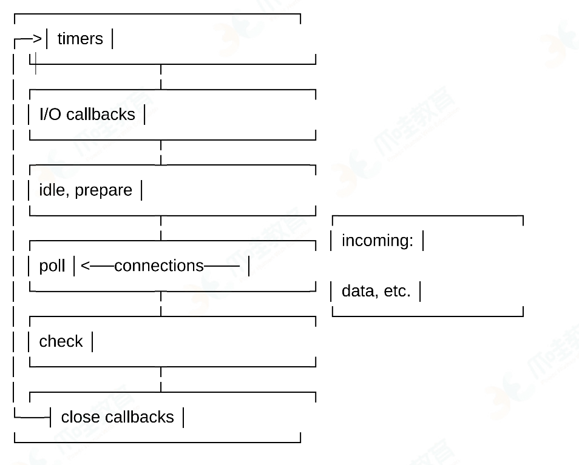

## 1.在JavaScript中，`0.1+0.2=0.3`吗？请阐述原因并给出解决方案  
> 这道题在网上有很多答案，解决方法也大相径庭，不过我在工作中就會经遇到过，在前端对订单的各种数额进行计算，并与后端的结果进行对比，保证计算结果精度正确。当然，问这道题，答案肯定是否，为什么呢？难道`0.1+0.2`不等于`0.3`吗？是的，在JS中，这道题的答案确实是`fa1se`,而`0.2+0.3`的结果却是`0.5`，原因在于JS采用EEE754标准定义的64位浮点格式表示数字，所以JS中的所有数字都是浮点数。按照JS的数字格式，整数有的范围是`-2^53~2^53`，而且只能表示有限个浮点数，能表示的个数为`2^64-2^53+3`个，浮点数的个数是无限的，这就导致了JS不能精确表达所有的浮点数，而只能是一个近似值。并且所有采用IEEE754标准的语言都会有这个问题，只是它们已经在其标准库中解决了这个问题。而很遗憾的是JS却没有。下面我们来分析一下运算过程： 
- 0.1的二进制表示为 `1.1001100110011001100110011001100110011001100110011001 1(0011)+ *2^-4`;
- 当64bit的存储空间无法存储完整的无限循环小数，而IEEE754 Floating-point(双精度)采用`round to nearest,tie to even`(四舍五入到最接近的偶数值)的舍入模式，因此0.1实际存储时的位模式是
`0-01111111011-1001100110011001100110011001100110011001100110011010`；
- 0.2的二进制表示为`1.10011001100110011001100110011001100110011001100110011(0011)+ *2^-3`;
- 当64bit的存储空间无法存储完整的无限循环小数，而IEEE754 Floating-point采用`round to nearest,tie to even`的舍入模式，因此0.2实际存储时的位模式是`0-01111111100-1001100110011001100110011001100110011001100110011010`
- 实际存储的位模式作为操作数进行浮点数加法，得到 `0-0111111111-0011001100110011001100110011001100110011001100110100`。转换为十进制即为`0.300000000000000040`。

那如何来解决这个问题呢？？原生的解决方法如下：  
> 
```javascript 
parseFloat((0.1 +0.2).toFixed(10))
```

更精确的解决方案如下：
```js
function accAdd(arg1, arg2){
    var v1, v2, m;
    try {
        r1 = arg1.toString().split('.')[1].length;
    } catch (e) {
        r1 = 0;
    }
    try {
        r2 = arg2.toString().split('.')[1].length;
    } catch (e) {
        r2 = 0;
    }

    m = Math.pow(10, Math.max(r1, r2))

    return (parseInt(arg1*m, 10) + parseInt(arg2*m, 10)) / m
}
```

可以按此原理抽象成自己的标准计算库，在各个项目中使用。    ✅ Do this - 1  在./utils下   取名字比如：Standard calculation tools/utils/library etc...


## 2.详细说明Event Loop
先说说概念吧，JS是一种单线程语言，所谓单线程，意思就是一次只能执行一个任务，如果有多个任务，那么就排队，执行完一个再执行下一个(还有其他方案，比如多线程或多进程)。这样的模式势必会造成资源浪费，也就是说，下一个任务必须等待，造成一种“假死”的情况，从而无法响应用户的行为。那为什么JS从一开始不设计为一个多线程语言呢？这是历史原因造成的，JS本身被创造出来就是为了解决一些简单问题的，并且JS没有锁机制，如果存在多线程，DOM操作将会变得复杂且不可控。当然，现在可以使用`Web Worker API`来实现多线程。
当这种等待机制运行时，会造成阻塞，这也就是同步机制，Event Loop就是为了解决这个问题而生的。
> ### Event Loop是一个程序结构，用于等待和发送消息和事件
简单说，就是在程序中设置两个线程：一个负责程序本身的运行，称为“主线程”；另一个负责主线程与其他进程（主要是各种I/O操作）的通信，被称为“Event Loop线程”(可以译为“消息线程”)。

每当遇到`I/O`的时候，主线程就让`Event Loop`线程去通知相应的`I/O`程序，然后接着往后运行，等到`I/O`程序完成操作，`Event Loop`线程再把结果返回主线程。主线程就调用事先设定的回调函数，完成整个任务。
上面介绍的这种运行模式，就被称为“异步模式”，或者“非阻塞模式”。
下面我们再用几个例子来说明`Event Loop`中的几个概念。
JS在执行的过程中会产生执行环境，这些执行环境会被顺序的加入到执行栈中。如果遇到异步的代码，会被挂起并加入到`Task`(有多种task)队列中。一旦执行栈为空，`Event Loop`就会从`Task`队列中拿出需要执行的代码并放入执行栈中执行，所以本质上来说JS中的异步还是同步行为。

```js
console.log('script start');
setTimeout (function(){
    console.log('setTimeout');
},0);
console.log('script end');

// script start -> script end ->  setTimeout
```

不同的任务源会被分配到不同的`Task`队列中，任务源可以分为微任务(`microtask`)和宏任务(`macrotask`)。在ES6规范中，`microtask`称为`jobs`,`macrotask`称为
`task`。

```js
console.log('script start');
setTimeout(function(){
    console.log('setTimeout')
},0)
new Promise((resolve)=>{
    console.log('Promise')
    resolve()
}).then(function(){
    console.log('promise1');
}).then(function(){
    console.log('promise2');
});
console.log('script end');

// script start => Promise => script end => promise1 => promise2 => setTimeout
```

✅ to do this - 微任务和宏任务，这些来龙去脉再搞搞清楚
微任务包括 `process.nextTick`, `promise`, `Object.observe`, `Mutationobserver`。
宏任务包括 `script`, `setTimeout`, `setInterval`, `setImmediate`, `I/O`, `UI rendering`。所以正确的一次`Event loop`顺序是这样的：
* 执行同步代码，这属于宏任务
* 执行栈为空，查询是否有微任务需要执行执行所有微任务
* 必要的话渲染UI
* 然后开始下一轮Event loop,执行宏任务中的异步代码

除此之外，这里不得不提一下，`Node`中也存在`Event Loop`机制，并且与浏览器中的b一样。

Node的Event loop分为6个阶段，它们会按照顺序反复运行


#### timer
`timers`阶段会执行`setTimeout`和`setInterval`
一个`timer`指定的时间并不是准确时间，而是在达到这个时间后尽快执行回调，可能会因为系统正在执行别的事务而延迟。
下限的时间有一个范围：[1,2147483647]，如果设定的时间不在这个范围，将被设置为1。
#### I/O
`I/O`阶段会执行除了`c1ose`事件，定时器和`setImmediate`的回调
#### idle,prepare
`idle`, `prepare`阶段内部实现
#### poll
`po11`阶段很重要，这一阶段中，系统会做两件事情
- 执行到点的定时器
- 执行`po11`队列中的事件
并且当`po11`中没有定时器的情况下，会发现以下两件事情
* 如果`pool`队列不为空，会遍历回调队列并同步执行，直到队列为空或者系统限制
* 如果`po11`队列为空，会有两件事发生
    - 如果有`setImmediate`需要执行，`poll`阶段会停止并且进入到`check`阶段执行`setImmediate`
    - 如果没有`setImmediate`需要执行，会等待回调被加入到队列中并立即执行回调,如果有别的定时器需要被执行，会回到`timer`阶段执行回调。
#### check
`check`阶段执行`setImmediate`
#### close callbacks
`close callbacks`阶段执行`close`事件  
并且在`Node`中，有些情况下的定时器执行顺序是随机的
```js
setTimeout(()=>{
    console.log('setTimeout');
},0);
setImmediate(()=>{
    console.log('setImmediate');
})
//这里可能会输出setTimeout,setImmediate
//可能也会相反的输出，这取决于性能
//因为可能进入 event loop 用了不到1毫秒，这时候会执行setImmediate
//否则会执行setTimeout
```

当然在这种情况下，执行顺序是相同的
```js
var fs = require('fs');
fs.readFile(_filename,()=>{
    setTimeout(()=> {
        console.log('timeout');
    },0);
    setImmediate(()=>{
        console.log('immediate');
    });
});
//因为readFile的回调在poll中执行
//发现有setImmediate,所以会立即跳到check阶段执行回调
//再去timer阶段执行setTimeout
//所以以上输出一定是 immediate, timeout
```
上面介绍的都是`macrotask`的执行情况，`microtask`会在以上每个阶段完成后立即执行。
```js
setTimeout(()=>{
    console.log('timer1')
    Promise.resolve().then(function(){
        console.log('promise1')
    })
},0)
setTimeout(()=>{
    console.log('timer2')
    Promise.resolve().then(function(){
        console.log('promise2')
    })
},0)
//以上代码在浏览器和node中打印情况是不同的
//浏览器中打印 timer1,promise1,timer2,promise2
//node中打印 timer1,timer2,promise1,promise2
```

`Node`中的`process.nextTick`会先于其他`microtask`执行。
```js
setTimeout(()=>{
    console.log("timer1");
    Promise.resolve().then(function(){
        console.log("promise1");
    });
},0);
process.nextTick(()=>{
    console.log("nextTick");
});
// nextTick,timer1,promise1
```

## 3.从输入`URL`到页面加载发生了什么？
这个问题很经典，也是很多面试高级前端时必问的问题。我也在面试时遇到过，只不过不同的是，面试官在这之前还问了一个问题，那就是从打开一个浏览器标签页开始，发生了什么。
也就是说，考察的是面试者对浏览器进程与线程的认知程度。下面是浏览器中进程的相关概念：
- 浏览器是多进程的
- 浏览器之所以能够运行，是因为系统给它的进程分配了资源(`cpu`、内存)
- 简单点理解，每打开一个`Tab`页，就相当于创建了一个独立的浏览器进程。  

也就是说，新打开一个TAB页，实际上就创建了一个浏览器进程，但是有时候会有不
同，为了性能考虑，浏览器的优化策略会将多个空的TAB页进程合并成一个，在有输入
内容之后才分离出来创建另一个新的浏览器进程。

下面来说说当输入`ul`之后，到底发生了什么。总体来说分为以下几个过程：
* `DNS`解析
* `TCP`连接
* 发送`HTTP`请求
* 服务器处理请求并返回`HTTP`报文
* 浏览器解析渲染页面
* 连接结束

#### DNS解析
这个过程实际上是浏览器将输入的`url`发送到`DNS`服务器进行查询，DNS服务器会返回
当前查询`url`的`IP`地址。它实际上充当了一个翻译的角色，实现了网址到`IP`地址的转换，`DNS`解析是一个递归查询的过程。


上图中演示的过程经历了`8`个步骡，如果每次都是这样，必然会损耗大量的资源，所以我们必须对DNS解析进行优化。
- `DNS`缓存：`DNS`存在着多级缓存，从离浏览器的距离排序的话，有以下几种：浏览器缓存，系统缓存，路由器缓存，`IPS`服务器缓存，根域名服务器缓存，顶级域名服务器缓存，主域名服务器缓存
- `DNS`负载均衡：`DNS`可以返回一个合适的机器的`IP`给用户，例如可以根据每台机器的负载量，该机器离用户地理位置的距离等等，这种过程就是`DNS`负载均衡，又叫做`DNS`重定向。大家耳熟能详的`CDN(Content Delivery Network)`就是利用`DNS`的重定向技术，`DNS`服务器会返回一个跟用户最接近的点的`IP`地址给用户，`CDN`节点的服务器负责响应用户的请求，提供所需的内容


> 上述两张图来源于 [八分钟带你读懂DNS域名解析流程](https://server.51cto.com/article/704508.html) 一文  
也可参见：   
[一文读懂DNS原理及解析过程](https://www.sfn.cn/news/technology/detail/222.html?navId=22)  
 [DNS域名解析过程](https://blog.csdn.net/bangshao1989/article/details/121913780)  
 [DNS解析全过程分析](https://www.cnblogs.com/fanfan259/p/10240670.html)
 [浅析DNS域名解析过程](https://cloud.tencent.com/developer/news/324975)  
 [域名解析的全过程](https://cloud.tencent.com/developer/article/2090100)

#### TCP连接
`HTTP`协议是使用`TCP`作为其传输层协议的，当`TCP`出现瓶颈时，`HTTP`也会受到影响。`HTTP`报文是包裹在`TCP`报文中发送的，服务器端收到`TCP`报文时会解包提取出
`HTTP`报文。但是这个过程中存在一定的风险，`HTTP`报文是明文，如果中间被截取的话
会存在一些信息泄露的风险。那么在进入`TCP`报文之前对`HTTP`做一次加密就可以解决
这个问题了。`HTTPS`协议的本质就是`HTTP+SSL(or TLS)`。在`HTTP`报文进入`TCP`报文之前，先使用`SSL`对`HTTP`报文进行加密。从网络的层级结构看它位于`HTTP`协议与`TCP`协议之间。

`HTTPS`在传输数据之前需要客户端与服务器进行一个握手(`TLS/SSL`握手)，在握手过程
中将确立双方加密传输数据的密码信息。`TLS/SSL`使用了非对称加密，对称加密以及`hash`等

#### HTTP请求
发送`HTTP`请求的过程就是构建`HTTP`请求报文并通过`TCP`协议中发送到服务器指定端
口(`HTTP`协议`80/8080`，`HTTPS`协议`443`)。`HTTP`请求报文是由三部分组成：请求行，请求报头和请求正文。  
请求行的格式如下：
> Method Request-URL HTTP-Version CRLF  

例如：  
> eg:GET index.html HTTP/1.1

常用的方法有：`GET`, `POST`, `PUT`, `DELETE`, `OPTIONS`, `HEAD`。

请求报头：请求报头允许客户端向服务器传递请求的附加信息和客户端自身的信息。常见
的请求报头有：`Accept`, `Accept-Charset`, `Accept-Encoding`, `Accept-Language`, `Content-Type`, `Authorization`, `Cookie`, `User-Agent`等。
`Accept`用于指定客户端用于接受哪些类型的信息，`Accept-Encoding`与`Accept`类似，它用于指定接受的编码方式。`Connection`设置为`Keep-alive`用于告诉客户端本次`HTTP`请求结束之后并不需要关闭`TCP`连接，这样可以使下次HTTP请求使用相同的TCP通道，节省`TCP`连接建立的时间。

请求正文：当使用`POST`, `PUT`等方法时，通常需要客户端向服务器传递数据。这些数据就储存在请求正文中。在请求包头中有一些与请求正文相关的信息，例如：现在的`Wb`应用通常采用`Rest`架构，请求的数据格式一般为`json`。这时就需要设置`Content-Type:application/json`

#### 服务器处理请求并返回HTTP报文
后端从在固定的端口接收到`TCP`报文开始，这一部分对应于编程语言中的`socket`。它会
对`TCP`连接进行处理，对`HTTP`协议进行解析，并按照报文格式进一步封装`HTTPRequest`对象，供上层使用。这一部分工作一般是由Web服务器去进行。  
`HTTP`响应报文也是由三部分组成：状态码，响应报头和响应报文。  
状态码是由`3`位数组成，第一个数字定义了响应的类别，且有五种可能取值：
* 1XX:指示信息-表示请求已接收，继续处理。
* 2Xx:成功-表示请求已被成功接收、理解、接受。
* 3Xx：重定向-要完成请求必须进行更进一步的操作。
* 4Xx：客户端错误-请求有语法错误或请求无法实现。
* 5xx:服务器端错误-服务器未能实现合法的请求。  

平时遇到比较常见的状态码有：`200`, `204`, `301`, `302`, `304`, `400`, `401`, `403`, `404`, `422`, `500`
响应报头：常见的响应报头字段有：`Server`, `Connection`...。
响应报文：服务器返回给浏览器的文本信息，通常`HTML`, `CSS`, `JS`,图片等文件就放在这一部分

#### 浏览器解析渲染页面
浏览器在收到`HTML`, `CSS`, `JS`文件后，它是如何把页面呈现到屏幕上的浏览器是一个边解析边渲染的过程。首先浏览器解析`HTML`文件构建`DOM`树，然后解析`CSS`文件构建渲染树，等到渲染树构建完成后，浏览器开始布局渲染树并将其绘制到屏幕上，这个过程比较复杂，涉及到两个概念：`ref1ow`(回流)和`repain`(重绘)。  
- `ref1ow`:`DOM`节点中的各个元素都是以盒模型的形式存在，这些都需要浏览器去计
算其位置和大小等，这个过程称为`reflow`
- `repain`当盒模型的位置，大小以及其他属性，如颜色，字体，等确定下来之后，刘览器开始绘制内容，这个过程称为`repain`

页面在首次加载时必然会经历`ref1ow`和`repain`。`reflow`和`repain`过程是非常消耗性能的，尤其是在移动设备上，它会破坏用户体验，有时会造成页面卡顿。所以我们应该尽可能少的减少`reflow`和`repain`。

`JS`的解析是由浏览器中的`JS`解析引擎完成的。`JS`是单线程运行，也就是说，在同一个时间内只能做一件事，所有的任务都需要排队，前一个任务结束，后一个任务于能开始。
但是又存在某些任务比较耗时，如`IO`读写等，所以需要一种机制可以先执行排在后面的
任务，这就是：同步任务(`synchronous`)和异步任务(`asynchronous`)。  
`JS`的执行机制就可以看做是一个主线程加上一个任务队列(`task queue`)。同步任务就是放在主线程上执行的任务，异步任务是放在任务队列中的任务。所有的同步任务在主线程
上执行，形成一个执行栈；异步任务有了运行结果就会在任务队列中放置一个事件；脚本
运行时先依次运行执行栈，然后会从任务队列里提取事件，运行任务队列中的任务，这个
过程是不断重复的，所以又叫做事件循环(`Event loop`)。  
浏览器在解析过程中，如果遇到请求外部资源时，如图像，`iconfont`,`JS`等。浏览器将重复上面的过程下载该资源。请求过程是异步的，并不会影响`HTML`文档进行加载，但是当文档加载过程中遇到`JS`文件，`HTML`文档会挂起渲染过程，不仅要等到文档中`JS`文件加载完毕还要等待解析执行完毕，才会继续`HTML`的渲染过程。原因是因为`JS`有可能修改`DOM`结构，这就意味着`JS`执行完成前，后续所有资源的下载是没有必要的，这就是
`JS`阻塞后续资源下载的根本原因。`CSS`文件的加载不影响`JS`文件的加载，但是却影响`JS`文件的执行。`JS`代码执行前浏览器必须保证`CSS`文件已经下载并加载完毕.

## 4. `TCP`、`UDP`和`HTTP`的区别
`TCP/IP`协议栈主要分为四层：应用层、传输层、网络层、数据链路层，每层都有相应的协议。  
* `IP`: 网络层协议；（类以于高速公路）
* `TCP`和`UDP`: 传输层协议；（类以于卡车）
* `HTTP`：应用层协议；（类似于货物）。`HTTP`(超文本传输协议)是利用`TCP`在两台
电脑（通常是`Web`服务器和客户端）之间传输信息的协议。客户端使用`Web`浏览器发起`HTTP`请求给`Web`服务器，`Web`服务器发送被请求的信息给客户端。  

其实重要的在`TCP`和`UDP`,那它们有什么区别呢？  
`TCP`(传输控制协议，`Transmission Control Protocol`), :(类似打电话)  
面向连接、传输可靠(保证数据正确性)、有序（保证数据顺序）、传输大量数据（流模式）、速度慢、对系统资源的要求多，程序结构较复杂，每一条TCP连接只能是点到点的，TCP首部开销`20`字节。

`UDP`(用户数据报协议，`User Data Protocol`)：(类似发短信)  
面向非连接、传输不可靠（可能丢包）、无序、传输少量数据（数据报模式）、速度
快，对系统资源的要求少，程序结构较简单，`UDP`支持一对一，一对多，多对一和多对
多的交互通信，`UDP`的首部开销小，只有`8`个字节。

`TCP`建立连接需要三次握手：
- 第一次握手：客户端发送`syn`包(`seq=x`)到服务器，并进入`SYN_SEND`状态，等待服务器确认；
- 第二次握手：服务器收到`syn`包，必须确认客户的`SYN（ack=x+1)`,同时自己也发送一个`SYN`包(`seq=y`),即`SYN+ACK`包，此时服务器进入`SYN_RECV`状态；
- 第三次握手：客户端收到服务器的`SYN+ACK`包，向服务器发送确认包`ACK(ack=y+1)`,此包发送完毕，客户端和服务器进入`ESTABLISHED`状态，完成三次握手。

握手过程中传送的包里不包含数据，三次握手完毕后，客户端与服务器才正式开始传送数
据。理想状态下，`TCP`连接一旦建立，在通信双方中的任何一方主动关闭连接之前，`TCP`连接都将被一直保持下去。

结论：
`HTTP`协议是建立在请求/响应模型上的。首先由客户建立一条与服务器的`TCP`链接，并发送一个请求到服务器，请求中包含请求方法、`URl`、协议版本以及相关的`MIME`样式的消息。服务器响应一个状态行，包含消息的协议版本、一个成功和失败码以及相关的`MIME`式样的消息。  
虽然`HTTP`本身是一个协议，但其最终还是基于`TCP`的。

> ✅ Do this - 2 四次挥手的过程？为什么非得3次握手4次挥手呢？别的次数不可以吗？

## 5. `HTTP`和`HTTPS`的区别
超文本传输协议`HTTP`协议被用于在`Web`浏览器和网站服务器之间传递信息，`HTTP`协议以明文方式发送内容，不提供任何方式的数据加密，如果攻击者截取了`Web`浏览器和网站服务器之间的传输报文，就可以直接读懂其中的信息。   
为了解决`HTTP`协议的这一缺陷，需要使用另一种协议：安全套接字层超文本传输协议。
`HTTPS`,为了数据传输的安全，`HTTPS`在`HTTP`的基础上加入了`SSL`协议，`SSL`依靠证书来验证服务器的身份，并为浏览器和服务器之间的通信加密。  
#### `HTTP`和`HTTPS`的基本概念
`HTTP`：是互联网上应用最为广泛的一种网络协议，是一个客户端和服务器端请求和应答的标准(`TCP`)，用于从`Web`服务器传输超文本到本地浏览器的传输协议，它可以使浏览器更加高效，使网络传输减少。  
`HTTPS`:是以安全为目标的`HTTP`通道，简单讲是`HTTP`的安全版，即`HTTP下`加入
`SSL`层，`HTTPS`的安全基础是`SSL`,因此加密的详细内容就需要`SSL`。  
`HTTPS`协议的主要作用可以分为两种：一种是建立一个信息安全通道，来保证数据传输的安全；另一种就是确认网站的真实性。  
#### HTTP与HTTPS有什么区别？
`HTTP`协议传输的数据都是未加密的，也就是明文的，因此使用HTTP协议传输隐私信息非常不安全，为了保证这些隐私数据能加密传输，于是网景公司设计了`SSL(Secure Sockets Layer)`.协议用于对`HTTP`协议传输的数据进行加密，从而就诞生了`HTTPS`。
##### `HTTPS`加密、加密、及验证过程
简单来说，`HTTPS`协议是由`SSL+HTTP`协议构建的可进行加密传输、身份认证的网络协议，要比`http`协议安全。  
##### `HTTPS`和`HTTP`的区别主要如下：  
- `https`协议需要到`ca`申请证书，一般免费证书较少，因而需要一定费用。
- `http`是超文本传输协议，信息是明文传输，`https`则是具有安全性的`ssl`加密传输协议。
- `http`和`https`使用的是完全不同的连接方式，用的端口也不一样，前者是`80`，后者是`443`。
- `http`的连接很简单，是无状态的；`HTTPS`协议是由`SSL+HTTP`协议构建的可进行加密传输、身份认证的网络协议，比`http`协议安全。

## 6.最不起眼的循环打印题
#### 问题  
先看下面的第一问，下列代码打印出什么？
```js
for (var i=0; i<10; i++){
    setTimeout(function(){
        console.log(i);
    },1000);
}
```

好了，是不是很经典？很多人在面试的时候都会被问到这个问题，`OK`,可能`80%`的同学都知道，它会打印出`10`个`10`来，为什么？  
这就考到作用域的问题了。实际上，`var`定义的变量在`for`循环之外是可以访问到的，也就是说，在执行`setTimeout`这个类似异步的操作之前，循环就已经结束了。这时的`i`已经为`10`，所以最后打印出来的也就是`10`个`10`了  
这就完了？呵呵，刚刚开始。  
#### 解决方案
下面来接着问，如何解决这个问题呢？有经验的同学都会想到使用`IIFE`,这也考察了面
试者对闭包的理解。  
```js
// 方案一
for (var i=0; i<10; i++){
    (function(i){
        setTimeout(function(){
            console.log(i);
        });
    })(i)
}
```
这样，就可以顺利的打印出`0~9`的结果了。如果还想考察，可以进一步问还有其他的
解决方案吗？可以提示：让每次循环的代码块都能正常的拿到`i`值即可。
```js
// 方案二
var output = function(i){
    setTimeout(function(){
        console.log(i);
    },1000);
}
for (var i=0; i<10; i++){
    output(i);
}
```
当然，最快的解决方案，有面试者可能会直接说出，利用`ES6`的`let`就可以，因为`1et`可以定义一个块级作用域嘛。
```js
// 方案三
for (let i=0; i<10; i++){
    setTimeout(function(){
        console.log(i)
    },1000)
}
```
`Promise`  
进一步，问利用`ES6`的`Promise`如何解决这个呢？下面给出答案，如果面试者能大概写
出来，那么是一个大大的加分。  
```js
// 方案四
const tasks = []
for (var i=0; i<10; i++){
    (function(i){
        tasks.push(new Promise((resolve)=>{
            setTimeout(()=>{
                console.log(i); // 0~9
                resolve()
            })
        }))
    })(i)
}

Promise.all(tasks).then(()=>
    setTimeout(()=>{
        console.log(i); // 10
    },1000)
)
```
这里实际上考察了面试者对`ES6`的`Promise`的理解程度。下面是一种更简洁的写法：
```js
// 方案四的简洁写法
const tasks = []
const output = (i) => new Promise(resolve => {
    setTimeout(()=>{
        console.log(i);
        resolve()
    },1000)
})

for (var i=0;i<10;i++){
    tasks.push(output(i));
}

Promise.all(tasks).then(()=>{
    setTimeout(()=>{
        console.log(i);
    },1000)
})

//最简洁写法：     需要debugger理解一下 ✅
new Promise((resolve) =>{
    for (var i=0; i<10; i++){
        console.log(i);
        resolve()
    }
})
```
`async/await`  
最后再来看下，更“变态”的，可以进一步使用`ES7`的`async/await`来解决，下面的代码摘自网上，不得不说，太牛掰了。
```js
// 方案五
const sleep = (timeout) => new Promise((resolve)=> {
    setTimeout(resolve,timeout);
});

(async ()=>{
    for (var i=0; i<10; i++){
        await sleep(1000);
        console.log(i);
    };
})();

//这里也有个最简洁写法：
(async ()=> {
    for (var i=0; i<10; i++){
        console.log(i)
    }
})();
```

## 7.防抖和节流
#### 防抖
什么是防抖？  
如果我们页面上有一个事件会被用户操作触发，而如果用户反复操作，就会被反复触发，这样带来的后果是性能低下和资源浪费。比如，页面有一个鼠标移入则会发送`aja×`请求的事件，如果用户反复的操作，就会浪费网络资源，不停的去请求。这时，我们就需要防抖。  
防抖的原理就是：当执行一个事件函数时，会等待一个阈(yu)值，可以设置为`n`秒，只有在`n`秒之后不再有操作，事件才会真正被触发。这样就不会引起页面抖动。
```js
function debounce(func, wait){
    var timeout;
    return function() {
        var context = this;
        var args = arguments;
        clearTimeout(timeout);
        timeout = setTimeout(function(){
            func.apply(context, args);   // ✅ call, bind, apply
        }, wait);
    }
}
```
#### 节流
节流的概念比较简单，就是当触发某个事件，每隔一段时间，只执行一次该事件。实现方式有两种：时间戳和定时器。
```js
//时间戳方式实现：
function throttle(func,wait){
    var context, args;
    var previous = 0;
    return function(){
        var now = +new Date();
        context = this;
        args = arguments;
        if (now - previous > wait){
            func.apply(context,args);
            previous = now;
        }
    }
}

//定时器方式：
function throttle(func,wait){
    var timeout;
    return function(){
        context = this;
        args = arguments;
        if (!timeout){
            timeout = setTimeout(function(){
                timeout = null;
                func.apply(context,args);
            },wait)
        }
    }
}
```
## 8.JavaScript中的设计模式
说说你了解并掌握的设计模式在`JavaScript`中的实现。 
#### 单例模式 `Singleton Pattern`
保证一个类只有一个实例，并提供一个访问它的全局访问点(调用一个类，任何时候返回的都是同一个实例)。  
实现方法：使用一个变量来标志当前是否已经为某个类创建过对象，如果创建了，则在下
一次获取该类的实例时，直接返回之前创建的对象，否则就创建一个对象。
```js
class Singleton{
    constructor(name){
        this.name = name;
        this.instance = null;
    }
    getName(){
        alert(this.name)
    }
    static getInstance(name){
        if (!this.instance){
            this.instance = new Singleton(name);
        }
        return this.instance
    }
}
```
#### 工厂模式 `Factory Pattern`
工厂模式定义一个用于创建对象的接口，这个接口由子类决定实例化哪一个类。该模式使一个类的实例化延迟到了子类。而子类可以重写接口方法以便创建的时候指定自己的对象类型。  
简单说：假如我们想在网页面里插入一些元素，而这些元素类型不固定，可能是图片、链接、文本，根据工厂模式的定义，在工厂模式下，工厂函数只需接受我们要创建的元类型，其他的工厂函数帮我们处理。
```js
//文本工厂
class Text {
    constructor(text){
        this.text = text;
    }
    insert(where){
        const txt = document.createTextNode(this.text);
        where.appendChild(txt);
    }
}
//链接工厂
class Link{
    constructor(url){
        this.url = url;
    }
    insert(where){
        const link = document.createElement('a');
        link.href = this.url;
        link.appendChild(document.createTextNode(this.url));
        where.appendChild(link);
    }
}
//图片工厂
class Image{
    constructor(url){
        this.url = url;
    }
    insert(where){
        const img = document.createElement('img');
        img.src = this.url;
        where.appendchild(img);
    }
}
//D0M工厂
class DomFactory{
    constructor(type){
        return new (this[type]())
    }
    //各流水线
    link(){return Link}
    text(){return Text}
    image(){return Image}
}

//创建工厂
const linkFactory = new DomFactory('link')
const textFactory new DomFactory('text')
linkFactory.url = 'https://surmon.me';
LinkFactory.insert(document.body);
textFactory.text = 'HI!I am surmon.';
textFactory.insert(document.body);
```

## 9.数据结构与算法题
#### 统计字符串中出现次数最多的字符
```js
let str = 'asdfghjklaqwertyuiopiaia';
const strChar = str => {
    let string = [...str],
        maxvalue = '',
        obj = {},
        max = 0;
    string.forEach(value => {
        obj[value] = obj[value] == undefined ? 1 : [value] + 1
        if (obj[value] > max) {
            max = obj[value]
            maxvalue = value
        }
    })
    return maxvalue;
}
```
#### 数组去重
```js
// forEach
let arr=['1','2','3','1','a','b','b'];
const unique = arr =>{
    let obj = {}
    arr.forEach(value => {
        obj[value]=0
    })
    return Object.keys(obj)
}

// filter
let arr=['1','2','3','1','a','b','b'];
const unique = arr => {
    return arr.filter((ele,index,array) =>{
        return index === array.indexof(ele)
    })
}

//set
let arr=['1','2','3','1','a','b','b'];
const unique = arr => {
    return [...new Set(arr)];
}
```